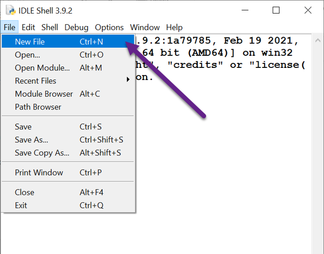
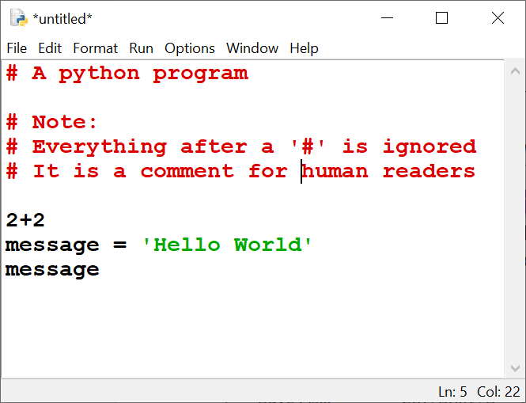
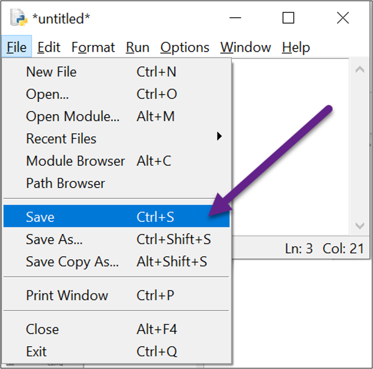
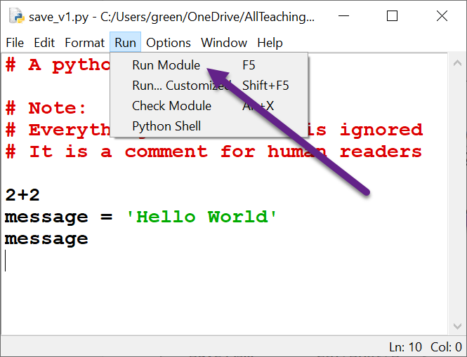
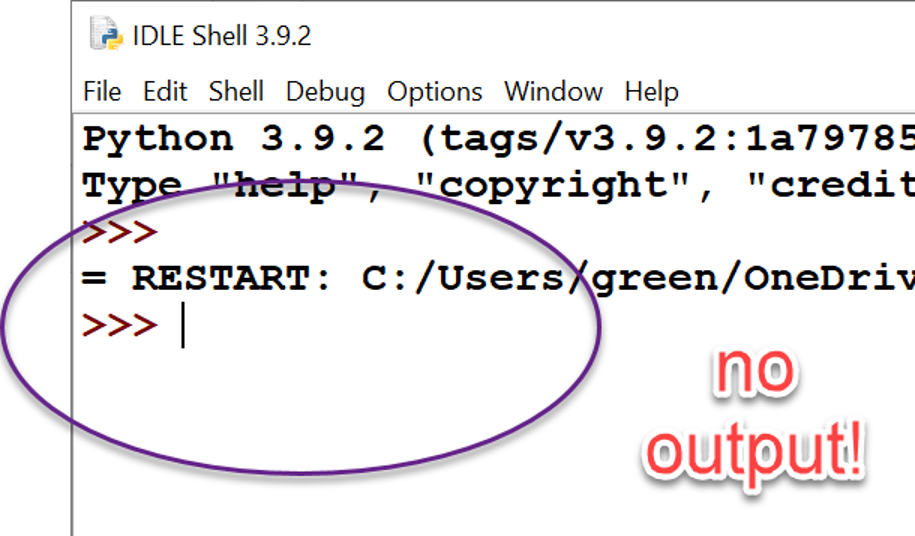

# LIN6209 Assignment #0

Getting started with Python.

## Install Python and Anaconda on your personal computer

### Python

Download the Python installer
from [www.python.com](https://www.python.com/ "The Python website")
and execute it.\
Follow the instructions and accept all the defaults.\
Confirm Python is working by executing a few test statements.

### Anaconda

Create an account on [www.anaconda.com](https://www.anaconda.com/ "The Anaconda
website") if you do not already have one.\
Log in and accept the terms of service.\
Click on the 'Download' button.\
Select the Python 3.7 version.\
Click on the 'Download' button.\

Download the Anaconda installer
from [www.anaconda.com](https://www.anaconda.com/ "The Anaconda
website") and execute it.\
Follow the instructions and accept all the defaults.\
Confirm Anaconda is working.

In its own words, Anaconda is:

```
A Python/R data science distribution and a collection of over 7,500+ 
open-source packages, which includes a package and environment manager. 
Anaconda Distribution is platform-agnostic, so you can use it whether you are
on Windows, macOS, or Linux.
It is also free to install and offers free community support.
```

Using Anaconda will simplify many of our lessons in the second half of this
module as it already includes all the libraries you would otherwise have to 
download and install into your python environment yourself.
Installing these external libraries yourself is not difficult, 
but it can be confusing and error-prone for beginners.
Using the Anaconda distribution with many its many libraries already installed
and tested can save you a lot of time.

We will use both standard Python and Anaconda throughout this module.

## Two important things to remember.

### Organise your file-space

Use File Manager (Windows) or Finder (macOS) to create a top level folder for
this course.
Call it 'code' or 'lin6209' or whatever is meaningful to you.
Within that course folder perhaps create folders for each unit of work and/or
assignment.

Python folders MUST follow the same naming convention as for variable names.

### Python program files

Every Python program file MUST:

* Have a file name that follows the same naming convention as variable names
* Have the file extension **.py**
* Be plain text.

So do NOT use a word processor to write your programs. Use a **text** editor
such as Notepad or TextEdit. Better still
use IDLE or another IDE.

# Writing, Saving, Editing, Executing and Debugging your Programs

## Creating a python program file

Open IDLE

### Create a new program file



### Type in your program



### Name and save the file into your chosen folder



## Editing an existing python program file

Do not 'double-click' a python file in File Explorer or Finder to open it for
editing as this will usually cause it to
execute.

* Open IDLE
* Use that to open the python program file
* After making your changes, save the file

## Run an existing python file

* Type `python_filename.py` at the OS prompt

or

* Select the file in your GUI and double-click it

or

* Open the program in IDLE and run it (press F5)



## Read the program output

Most of the programs we have written so far when run from stored file will
produce no visible output:



To output a result from your python program, we need to use the built-in
function print()

## The print() function

One of the first differences you will notice between running a program from a
saved file and typing in exactly
the same code at the interactive prompt is that running it from the saved file
produces no output!

This is a deliberate and very sensible design choice made by the original
authors of python, but it can make it hard
to see what the individual steps of your program are doing, particularly when
you are first learning Python.
The print() function can be very helpful in such situations.

The print() function converts all of its parameters to strings and sends the
result to the output console which by
default on your PC screen.
Place whatever variables or values or expressions you want printed to the screen
between the brackets, separated by
commas if there are more than one.

For example:

```
s = 'spam'
print(s)
print("I'll have", (s + ' and')*3, s, 'please!')
```

## Documentation

The documentation for Python is at [www.python.org](https://www.python.org).
There you will find the formal definition
of the language, a tutorial (which assumes you already have some coding
knowledge in another language),
the standard library with object and method definitions, examples of code, and
an extensive and very detailed index.
It is an invaluable resource for all Python programmers so be sure to get used
to finding your way around it.

Anaconda has many FAQs, guides, tutorials, and follow-alog videos
at https://www.anaconda.com/


