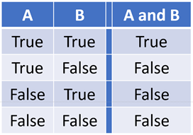
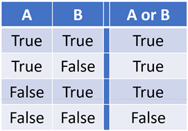
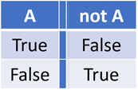
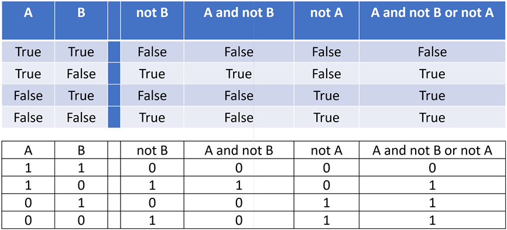
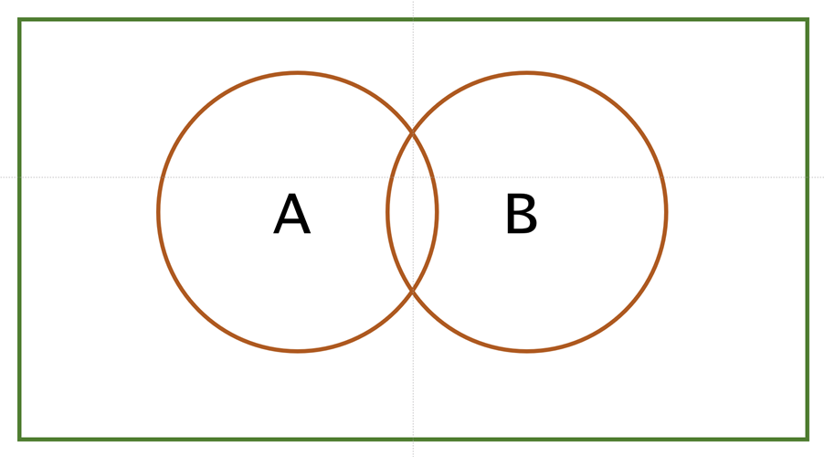

# Boolean Algebra

Evaluate these Boolean equations on paper first, then confirm your deductions by executing each statement
individually in IDLE:

``` python

True and True     
True or True
not True

False and False     
False or False
not False

True and False     
True or False

not not not True and False
not not not True or False
```

# Truth Tables and Venn Diagrams

These can be helpful when evaluating Boolean expressions. This section is not directly assessed but both are
very handy tools when you need them. For instance, the truth value of this expression is not immediately
apparent:

``` python

(a or not b) and (not b or not a) or (b and not a)
```

It is good practice to design your code so that Boolean conditions are individually simple.

## Truth Tables

### AND truth table



### OR truth table



### NOT truth table



### Example truth Table: A and not B or not A



## Venn Diagrams

These are a simple way of representing the boolean condition



## Section – more practice

Go to www.w3schools.com and work through the functions tutorial and tests
https://www.w3schools.com/python/python_functions.asp  
By now you should be familiar with most of the content within the following sections of W3Schools:
https://www.w3schools.com/python/python_comments.asp  
https://www.w3schools.com/python/python_variables.asp  
https://www.w3schools.com/python/python_numbers.asp  
https://www.w3schools.com/python/python_casting.asp  
https://www.w3schools.com/python/python_strings.asp  
https://www.w3schools.com/python/python_booleans.asp  
https://www.w3schools.com/python/python_operators.asp  
https://www.w3schools.com/python/python_functions.asp  
